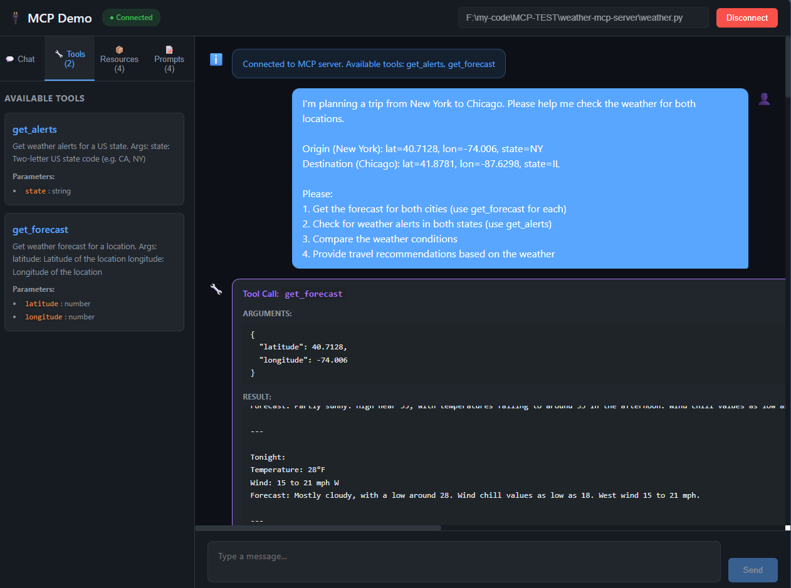
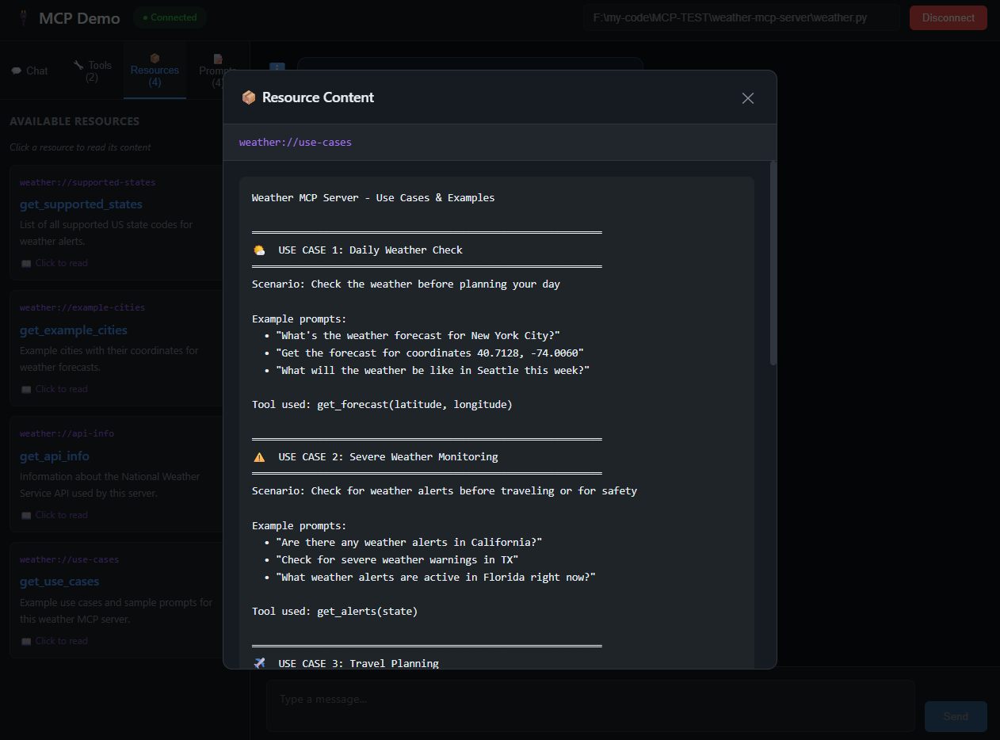
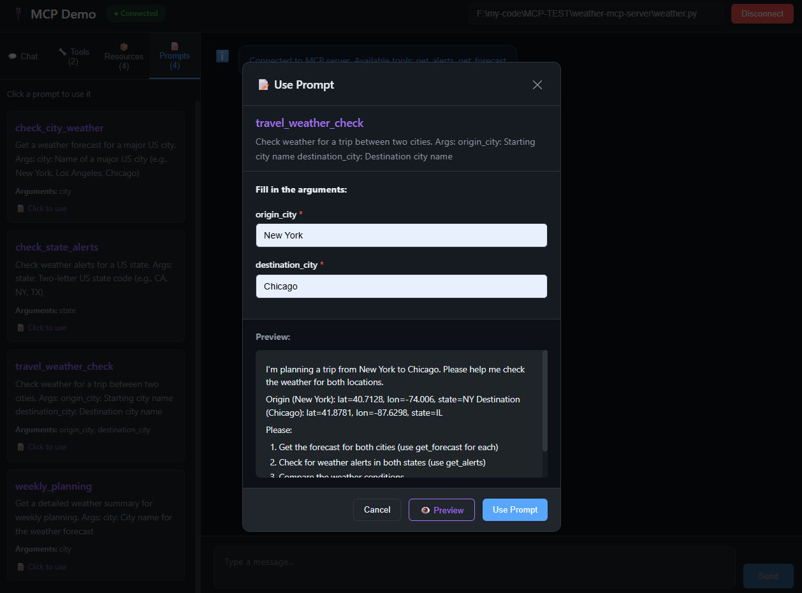
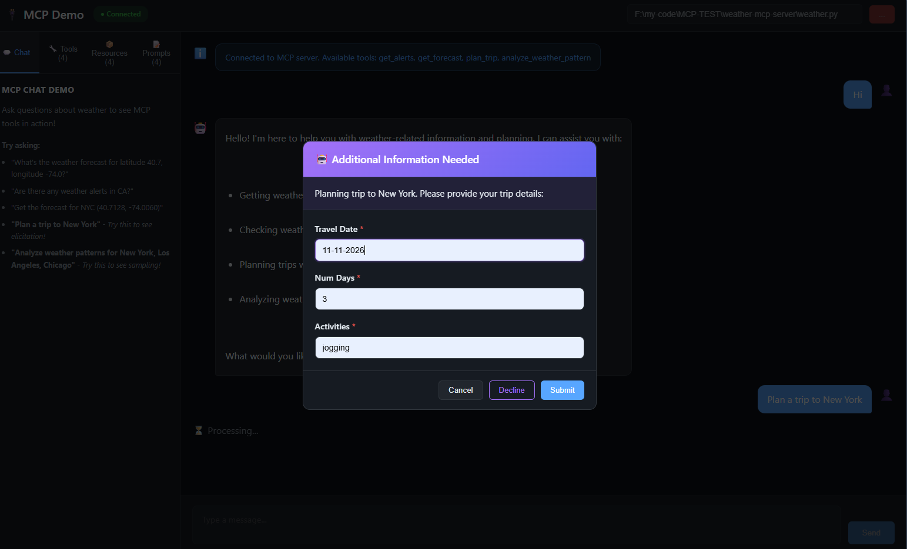
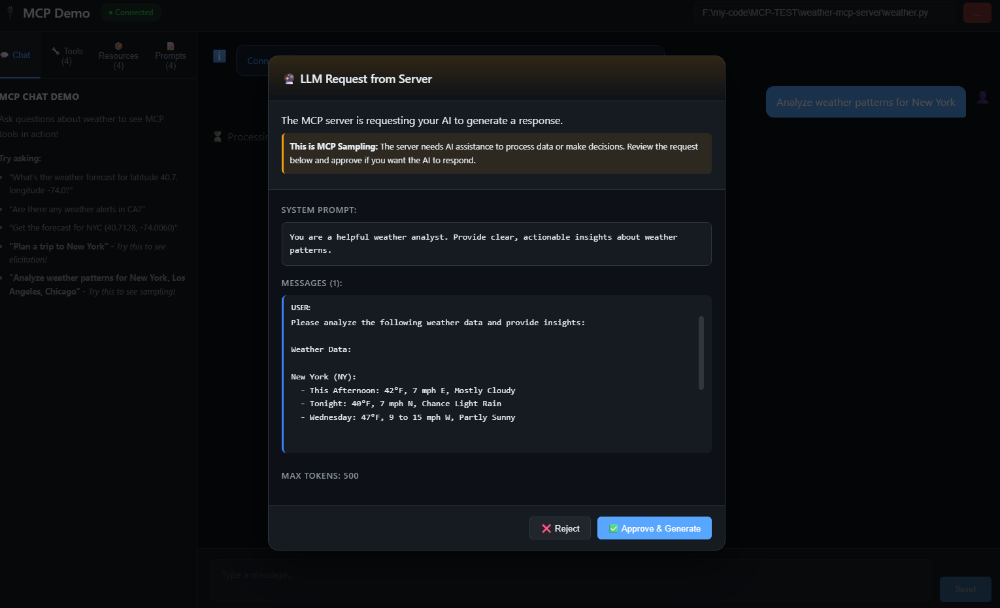

# MCP Demo Project

A practical demonstration of the **Model Context Protocol (MCP)** - showing how to build **MCP Servers** and **MCP Clients** for AI applications.

## What is MCP?

MCP is a protocol that standardizes how AI applications communicate with external data and tools. It has two sides:

- **MCP Server** - Exposes capabilities (tools, resources, prompts) for AI to use
- **MCP Client** - Lives in your AI application, connects to servers, orchestrates LLM + tools

```
┌─────────────────────────────────────┐
│   Your AI Application               │
│   ┌─────────────────────────────┐   │
│   │  MCP Client                 │   │
│   │  - Connects to MCP servers  │   │
│   │  - Manages tool execution   │   │
│   │  - Orchestrates with LLM    │   │
│   └──────────────┬──────────────┘   │
└──────────────────┼──────────────────┘
                   │ MCP Protocol
                   ▼
┌─────────────────────────────────────┐
│   MCP Server                        │
│   - Exposes Tools, Resources,       │
│     Prompts                         │
└─────────────────────────────────────┘
```

### Who is this for?

If you're building or maintaining **AI-powered applications**, you need to understand both:
- **Building servers** to expose your APIs/data to AI
- **Building clients** to connect your AI app to MCP servers

## Project Structure

```
MCP-TEST/
├── weather-mcp-server/     # MCP Server (Python + FastMCP)
│   └── weather.py          # Exposes weather tools, resources, prompts
│
├── mcp-demo-backend/       # MCP Client + API (FastAPI)
│   ├── main.py             # App setup, CORS, router registration
│   ├── config.py           # API key, CORS origins
│   ├── models.py           # Pydantic request/response schemas
│   ├── mcp_client.py       # Unified MCP client with elicitation support
│   └── routes/
│       ├── http.py         # REST endpoints (no elicitation)
│       └── websocket.py    # WebSocket with elicitation support
│
├── mcp-demo-frontend/      # Web UI (Vite + React)
│   └── src/App.jsx         # Chat interface with MCP features
│
└── NOTES.md                # Detailed notes & troubleshooting
```

---

# MCP Server Features

The MCP server exposes three core feature types. Here's how each works in practice:

## 1. Tools 🔧
**Actions the AI can execute** - like API calls or functions.

Tools let the AI *do things*. When you ask "What's the weather in NYC?", the AI calls the `get_forecast` tool with coordinates.

```python
@mcp.tool()
async def get_forecast(latitude: float, longitude: float) -> str:
    """Get weather forecast for a location."""
    # Calls National Weather Service API
    # Returns formatted forecast
```



**In the UI:** Ask a question → AI decides to use a tool → Tool executes → AI summarizes the result.

---

## 2. Resources 📦
**Data the AI can read** - static or dynamic information.

Resources are like files or documents the AI can access. They're read-only and URI-addressable.

```python
@mcp.resource("weather://supported-states")
def get_supported_states() -> str:
    """List of all supported US state codes."""
    return "AL: Alabama, AK: Alaska, ..."

@mcp.resource("weather://example-cities")
def get_example_cities() -> str:
    """Cities with pre-loaded coordinates."""
    return "New York: 40.7128, -74.0060 ..."
```



**In the UI:** Click a resource → See its content. The AI can also read these to get context.

---

## 3. Prompts 📝
**Pre-built conversation starters** - structured input templates.

Prompts guide users through common workflows with forms instead of free text.

```python
@mcp.prompt()
def weekly_planning(city: str) -> str:
    """Get a detailed weather summary for weekly planning."""
    return f"""I need to plan my week in {city}. 
    Please get the forecast and any alerts, then provide:
    1. Day-by-day breakdown
    2. Best days for outdoor activities
    3. Clothing recommendations"""
```



**In the UI:** Select a prompt → Fill in arguments → Preview → Use in chat.

---

## 4. Elicitation 💬
**Tools that ask follow-up questions** - interactive mid-execution input.

Elicitation allows a tool to pause execution and ask the user for additional information. This enables conversational, multi-step workflows.

```python
from pydantic import BaseModel

class TripDetails(BaseModel):
    travel_date: str
    num_days: int
    activities: str

@mcp.tool()
async def plan_trip(destination: str, ctx: Context) -> str:
    """Plan a trip with weather-aware recommendations."""
    
    # Pause and ask user for details
    result = await ctx.elicit(
        message=f"Planning trip to {destination}. Please provide details:",
        schema=TripDetails
    )
    
    if result.action == "cancel":
        return "Trip planning cancelled."
    
    # Continue with user's input
    trip_data = result.data
    # ... fetch weather, generate recommendations
```

**In the UI:** 
1. Ask "Plan a trip to New York"
2. AI calls `plan_trip` tool
3. Modal appears asking for travel date, duration, activities
4. User fills form and submits
5. Tool continues with that data
6. AI returns personalized trip plan with weather

**Why Elicitation matters:** Traditional tools are fire-and-forget. Elicitation enables tools that have a conversation with the user, gathering context as needed.



---

## 5. Sampling 🤖
**Server requests AI assistance from client** - reverse LLM flow.

Sampling allows the MCP server to request the client's LLM to process data. Instead of the client asking the AI to use tools, the **tool asks the client for AI help**.

```python
from mcp.types import SamplingMessage, TextContent as MCPTextContent

@mcp.tool()
async def analyze_weather_pattern(cities: str, ctx: Context) -> str:
    """Analyze weather patterns using AI assistance."""
    
    # Fetch weather data for cities...
    weather_data = await fetch_weather(cities)
    
    # Request client's LLM to analyze the data
    result = await ctx.session.create_message(
        messages=[
            SamplingMessage(
                role="user",
                content=MCPTextContent(
                    type="text",
                    text=f"Analyze this weather data: {weather_data}"
                )
            )
        ],
        max_tokens=500,
        system_prompt="You are a weather analyst."
    )
    
    return f"Analysis: {result.content.text}"
```

**In the UI:**
1. Ask "Analyze weather patterns for New York, Los Angeles, Chicago"
2. AI calls `analyze_weather_pattern` tool
3. Tool fetches weather data from NWS API
4. Tool requests AI analysis via sampling
5. Modal appears: "Server wants AI to analyze data. Approve?"
6. User clicks "Approve & Generate"
7. Client's LLM analyzes the weather data
8. Tool returns combined raw data + AI analysis

**Why Sampling matters:**
- **Server doesn't need its own AI** - uses client's LLM access
- **Human in the loop** - user sees and approves what server is asking
- **Data locality** - server only sends what's needed for analysis
- **Consistent AI** - same model for all operations



---

# MCP Client Features

The backend implements an MCP Client that connects to servers and orchestrates tool execution with Claude.

## Architecture

```
┌─────────────────────────────────────────────────────────┐
│  Frontend (React)                                       │
│  - WebSocket connection for real-time chat              │
│  - Elicitation modal for user input                     │
└────────────────────────┬────────────────────────────────┘
                         │ WebSocket
                         ▼
┌─────────────────────────────────────────────────────────┐
│  Backend (FastAPI)                                      │
│  ┌───────────────────────────────────────────────────┐  │
│  │  MCP Client                                       │  │
│  │  - Connects to MCP servers via stdio              │  │
│  │  - Sends queries to Claude                        │  │
│  │  - Executes tool calls                            │  │
│  │  - Handles elicitation callbacks                  │  │
│  └───────────────────────────────────────────────────┘  │
└────────────────────────┬────────────────────────────────┘
                         │ stdio
                         ▼
┌─────────────────────────────────────────────────────────┐
│  MCP Server (weather.py)                                │
│  - Tools, Resources, Prompts                            │
│  - Elicitation via ctx.elicit()                         │
│  - Sampling via ctx.session.create_message()            │
└─────────────────────────────────────────────────────────┘
```

## Why WebSocket?

HTTP is request-response: one request → one response.

Elicitation and Sampling require **multiple exchanges** during a single "chat":
1. User sends message
2. AI starts processing, tool needs input (elicitation) or AI help (sampling)
3. Server sends request to client
4. User responds (elicitation) or approves AI call (sampling)
5. Tool continues
6. Server sends final response

This is impossible with HTTP. WebSocket provides the bidirectional channel needed.

---

# Quick Start

## Prerequisites
- Python 3.11+ with conda
- Node.js 18+
- Anthropic API key

## 1. Set up the MCP Server

```bash
cd weather-mcp-server
conda activate mcp
# Server runs via stdio, started automatically by the client
```

## 2. Start the Backend

```bash
cd mcp-demo-backend
# Create .env with your API key
echo ANTHROPIC_API_KEY=your-key-here > .env

conda activate mcp
uvicorn main:app --reload --port 8000
```

## 3. Start the Frontend

```bash
cd mcp-demo-frontend
npm install
npm run dev
# Open http://localhost:5173
```

## 4. Connect & Test

1. Click **Connect** in the UI
2. Try: *"What's the weather forecast for NYC?"*
3. Watch the AI use the `get_forecast` tool
4. Explore Resources and Prompts tabs

---

# Key Concepts

| Feature | What it is | Analogy |
|---------|------------|---------|
| **Tools** | Actions to execute | Verbs - *"do something"* |
| **Resources** | Data to read | Nouns - *"get information"* |
| **Prompts** | Structured templates | Forms - *"guided workflow"* |
| **Elicitation** | Mid-execution questions | Dialog - *"ask for more"* |
| **Sampling** | Server requests AI help | Delegation - *"analyze this for me"* |

---

# Backend Structure

```
mcp-demo-backend/
├── main.py             # FastAPI app, CORS, router registration
├── config.py           # Environment config (API key, CORS origins)
├── models.py           # Pydantic schemas for API requests/responses
├── mcp_client.py       # Unified MCP client
│   ├── MCPClient       # Main class
│   ├── connect()       # Connect to MCP server via stdio
│   ├── list_tools()    # Get available tools
│   ├── list_resources()# Get available resources
│   ├── list_prompts()  # Get available prompts
│   ├── call_tool()     # Execute a tool (with optional elicitation)
│   └── process_query() # Full Claude conversation loop
│
└── routes/
    ├── http.py         # REST API (no elicitation support)
    │   └── /status, /connect, /chat, /tools, /resources, /prompts
    │
    └── websocket.py    # WebSocket API (with elicitation)
        └── /ws/chat    # Real-time chat with elicitation support
```

---

# Next Steps

- [x] ~~Add Elicitation support~~ ✅ Implemented!
- [x] ~~Add Sampling feature~~ ✅ Implemented!
- [ ] Add Roots feature

---

## Resources

- 📘 **[NOTES.md](NOTES.md)** - Detailed MCP concepts, architecture diagrams, and implementation notes
- [MCP Documentation](https://modelcontextprotocol.io/)
- [FastMCP Python SDK](https://github.com/jlowin/fastmcp)
- [Anthropic API](https://docs.anthropic.com/)
